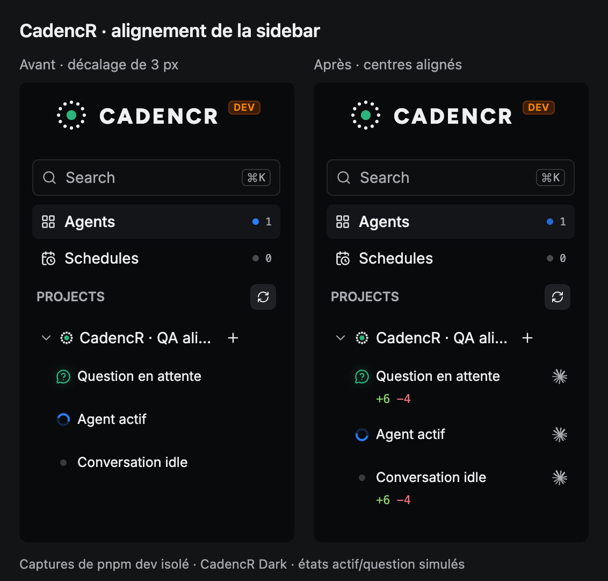

# Sidebar alignment QA

## Browser regression check

`ProjectFeatures.test.tsx` checks the hierarchy structure and collapse behavior.
jsdom has no layout engine, so actual spacing is checked separately in the running
app with [sidebar-status-project-alignment.check.js](sidebar-status-project-alignment.check.js).
The check measures rendered rectangles; it does not assert CSS class names.

1. Start an isolated `pnpm dev` instance with its own ports, profile and QA database.
2. Expand a project containing a root parent, its visible child, and a root leaf.
3. Load the check script into that page's DevTools console (or browser automation).
4. Call it with the project, parent and leaf IDs:

```js
checkSidebarStatusProjectAlignment(1, 1, 3);
```

The check requires a nonzero empty leaf gutter, equal parent/leaf gutter widths,
and equal horizontal centers for both statuses and the actual project badge.
It throws on failure, with a tolerance of 0.5 CSS px for rounding.

## Results — 2026-10-02

QA used frontend port `1421`, service port `5101`, and a separate database in
`/tmp/cadencr-sidebar-qa-927c/qa.db`. No agent was run. The hierarchy relation
and working/question states were visual fixtures in the isolated browser only;
they were not written to the backend database.

| Measurement                                     | Result, CSS px                    |
| ----------------------------------------------- | --------------------------------- |
| Project badge / root parent / root leaf centers | `45 / 45 / 45`                    |
| Parent / empty leaf gutter widths               | `14 / 14`                         |
| Child status center                             | `61` (existing 16 px indentation) |
| Root row height before / during hover           | `51.75 / 51.75`                   |
| Child row height before / during hover          | `38 / 38`                         |

- The geometry check passed with idle and working/question fixtures, and after
  selecting the parent and hovering both root rows.
- Temporarily giving the empty leaf gutter zero width in the browser caused
  `The empty leaf gutter no longer reserves space`; normal geometry passed again
  after removing that temporary override. No repository source was changed for
  this negative check.
- Collapsing the parent hid its child without navigation or moving the status.
- Worktree-group layout was not exercised in this additional QA.
- This browser check is executable QA evidence, not part of the jsdom CI suite.

## Before / after



The original capture uses CadencR Dark. The after image also contains loaded
provider marks and Git counters. Providers remain separate from conversation
status and project identity.
